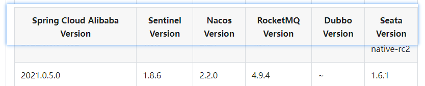

# backend-fullstack-learning

[TOC]

【谷粒商城】

- https://www.bilibili.com/video/BV1np4y1C7Yf/?p=192&spm_id_from=pageDriver&vd_source=b850b3a29a70c8eb888ce7dff776a5d1

【msdq】https://www.bilibili.com/video/BV1ez42197Zd/?spm_id_from=333.1007.tianma.1-1-1.click&vd_source=b850b3a29a70c8eb888ce7dff776a5d1

[计算机组成原理]

https://www.bilibili.com/video/BV1vt421L7oc/?spm_id_from=333.1007.tianma.2-1-4.click&vd_source=b850b3a29a70c8eb888ce7dff776a5d1

https://easydoc.net/s/78237135/ZUqEdvA4/HqQGp9TI


[Elasticsearch-Rest-High-Level-Client官网文档](https://www.elastic.co/guide/en/elasticsearch/client/java-rest/current/java-rest-high-search.html)

前端用户密码：admin/admin

- SpringBoot 2.7.8

- SpringCloud 2021.0.9
- SpringCloudAlibaba套装




# Elasticsearch的Mapping

- product-mapping

```bash
PUT product
{
  "settings": {
    "number_of_shards": 1,
    "number_of_replicas": 0
  },
  "mappings": {
    "properties": {
      "skuId": {
        "type": "long"
      },
      "spuId": {
        "type": "keyword"
      },
      "skuTitle": {
        "type": "text",
        "analyzer": "ik_smart"
      },
      "skuPrice": {
        "type": "double"
      },
      "skuImg": {
        "type": "keyword",
        "index": false,
        "doc_values": false
      },
      "saleCount": {
        "type": "long"
      },
      "hasStock": {
        "type": "boolean"
      },
      "hotScore": {
        "type": "long"
      },
      "brandId": {
        "type": "long"
      },
      "catalogId": {
        "type": "long"
      },
      "brandName": {
        "type": "keyword"
      },
      "brandImg": {
        "type": "keyword"
      },
      "catalogName": {
        "type": "keyword"
      },
      "attrs": {
        "type": "nested",
        "properties": {
          "attrId": {
            "type": "long"
          },
          "attrName": {
            "type": "keyword"
          },
          "attrValue": {
            "type": "keyword"
          }
        }
      }
    }
  }
}
```

- 商品的查询DSL

```bash
GET product/_search
{
  "query": {
    "bool": {
      "must": [
        {
          "match": {
            "skuTitle": "华为"
          }
        }
      ],
      "filter": [
        {
          "term": {
            "catalogId": 225
          }
        },
        {
          "terms": {
            "brandId": [
              1,
              2,
              9
            ]
          }
        },
        {
          "nested": {
            "path": "attrs",
            "query": {
              "bool": {
                "must": [
                  {
                    "term": {
                      "attrs.attrId": 6
                    }
                  },
                  {
                    "terms": {
                      "attrs.attrValue": [
                        "32GB",
                        "64GB"
                      ]
                    }
                  }
                ]
              }
            }
          }
        },
        {
          "term": {
            "hasStock": true
          }
        },
        {
          "range": {
            "skuPrice": {
              "gte": 5000,
              "lte": 10000
            }
          }
        }
      ]
    }
  },
  "sort": [
    {
      "skuPrice": {
        "order": "desc"
      }
    }
  ],
  "from": 0,
  "size": 5,
  "highlight": {
    "fields": {
      "skuTitle": {}
    },
    "pre_tags": "<span color='red'>",
    "post_tags": "</span>"
  },
  "aggs": {
    "brand_agg": {
      "terms": {
        "field": "brandId",
        "size": 10
      },
      "aggs": {
        "brand_name_agg": {
          "terms": {
            "field": "brandName",
            "size": 10
          }
        },
        "brand_img_agg": {
          "terms": {
            "field": "brandImg",
            "size": 10
          }
        }
      }
    },
    "catalog_agg": {
      "terms": {
        "field": "catalogId",
        "size": 10
      },
      "aggs": {
        "catalog_name_agg": {
          "terms": {
            "field": "catalogName",
            "size": 10
          }
        }
      }
    },
    "attr_agg": {
      "nested": {
        "path": "attrs"
      },
      "aggs": {
        "attr_id_agg": {
          "terms": {
            "field": "attrs.attrId",
            "size": 10
          },
          "aggs": {
            "attr_name_agg": {
              "terms": {
                "field": "attrs.attrName",
                "size": 10
              }
            },
            "attr_value_agg":{
              "terms": {
                "field": "attrs.attrValue",
                "size": 10
              }
            }
          }
        }
      }
    }
  }
}
```


# Nginx配置

- 本地hosts

```bash
# 虚拟机ip
192.168.32.116		fsmall.com
```

- nginx.conf

```nginx
......
    #gzip  on;

    upstream fsmall {
	    # 本地ip
        server 192.168.32.1:88;
    }

    include /etc/nginx/conf.d/*.conf;
......
```

- fsmall.com

```nginx
server {
    listen       80;
    server_name  fsmall.com *.fsmall.com;

    #access_log  /var/log/nginx/host.access.log  main;

    # fullstack-*各个项目下的static（含）目录上传到nginx的html目录下，最终static下包含index/search/...
    location /static {
        root   /usr/share/nginx/html;
    }
    
    location / {
        proxy_pass  http://fsmall;
        proxy_set_header Host $host;
    }
}
```

