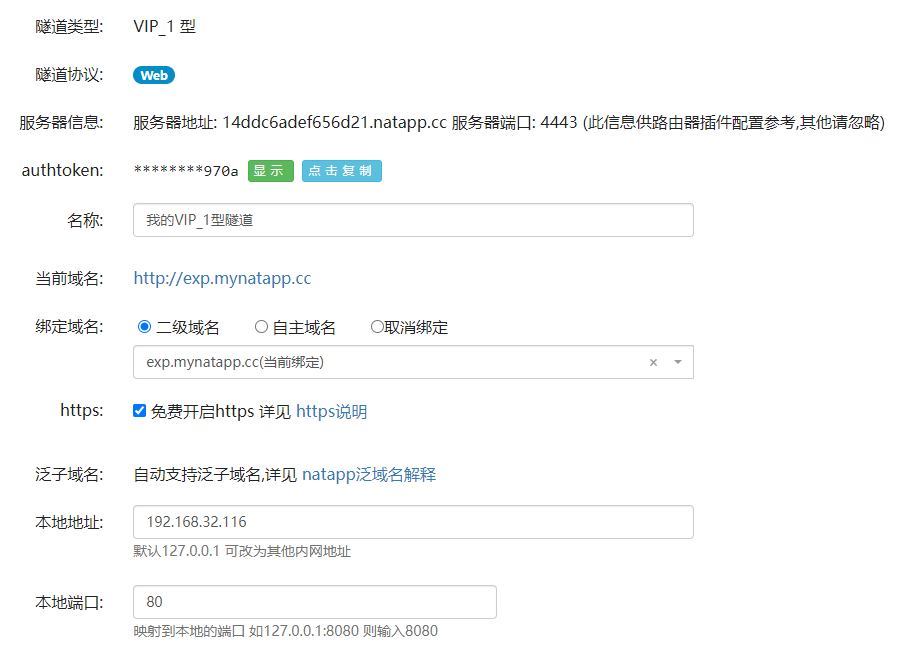
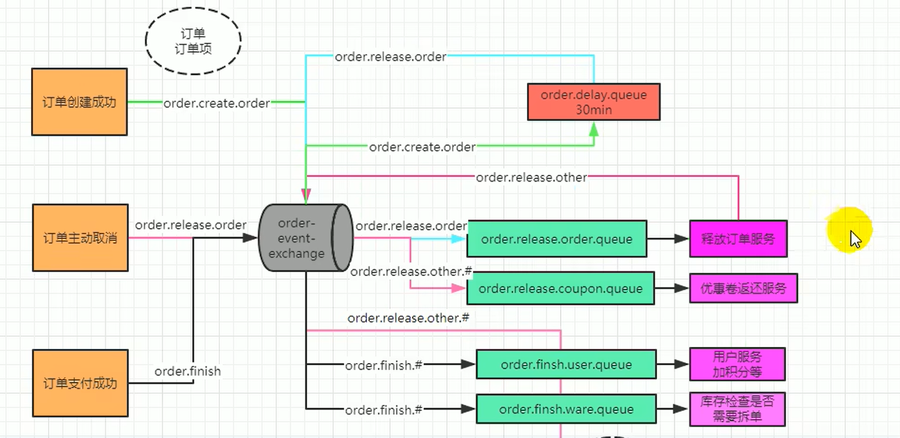
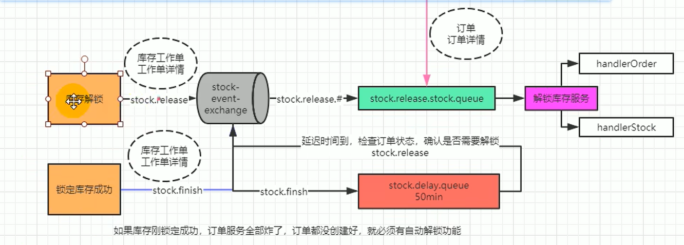

# backend-fullstack-learning

[TOC]

【谷粒商城】

- https://www.bilibili.com/video/BV1np4y1C7Yf/?p=404&spm_id_from=pageDriver&vd_source=b850b3a29a70c8eb888ce7dff776a5d1

【msdq】https://www.bilibili.com/video/BV1ez42197Zd/?spm_id_from=333.1007.tianma.1-1-1.click&vd_source=b850b3a29a70c8eb888ce7dff776a5d1

[计算机组成原理]

https://www.bilibili.com/video/BV1vt421L7oc/?spm_id_from=333.1007.tianma.2-1-4.click&vd_source=b850b3a29a70c8eb888ce7dff776a5d1

https://easydoc.net/s/78237135/ZUqEdvA4/HqQGp9TI


[Elasticsearch-Rest-High-Level-Client官网文档](https://www.elastic.co/guide/en/elasticsearch/client/java-rest/current/java-rest-high-search.html)

前端用户密码：admin/admin

- SpringBoot 2.7.8

- SpringCloud 2021.0.9
- SpringCloudAlibaba套装


# Elasticsearch的Mapping

- product-mapping

```bash
PUT product
{
  "settings": {
    "number_of_shards": 1,
    "number_of_replicas": 0
  },
  "mappings": {
    "properties": {
      "skuId": {
        "type": "long"
      },
      "spuId": {
        "type": "keyword"
      },
      "skuTitle": {
        "type": "text",
        "analyzer": "ik_smart"
      },
      "skuPrice": {
        "type": "double"
      },
      "skuImg": {
        "type": "keyword",
        "index": false,
        "doc_values": false
      },
      "saleCount": {
        "type": "long"
      },
      "hasStock": {
        "type": "boolean"
      },
      "hotScore": {
        "type": "long"
      },
      "brandId": {
        "type": "long"
      },
      "catalogId": {
        "type": "long"
      },
      "brandName": {
        "type": "keyword"
      },
      "brandImg": {
        "type": "keyword"
      },
      "catalogName": {
        "type": "keyword"
      },
      "attrs": {
        "type": "nested",
        "properties": {
          "attrId": {
            "type": "long"
          },
          "attrName": {
            "type": "keyword"
          },
          "attrValue": {
            "type": "keyword"
          }
        }
      }
    }
  }
}
```

- 商品的查询DSL

```bash
GET product/_search
{
  "query": {
    "bool": {
      "must": [
        {
          "match": {
            "skuTitle": "华为"
          }
        }
      ],
      "filter": [
        {
          "term": {
            "catalogId": 225
          }
        },
        {
          "terms": {
            "brandId": [
              1,
              2,
              9
            ]
          }
        },
        {
          "nested": {
            "path": "attrs",
            "query": {
              "bool": {
                "must": [
                  {
                    "term": {
                      "attrs.attrId": 6
                    }
                  },
                  {
                    "terms": {
                      "attrs.attrValue": [
                        "32GB",
                        "64GB"
                      ]
                    }
                  }
                ]
              }
            }
          }
        },
        {
          "term": {
            "hasStock": true
          }
        },
        {
          "range": {
            "skuPrice": {
              "gte": 5000,
              "lte": 10000
            }
          }
        }
      ]
    }
  },
  "sort": [
    {
      "skuPrice": {
        "order": "desc"
      }
    }
  ],
  "from": 0,
  "size": 5,
  "highlight": {
    "fields": {
      "skuTitle": {}
    },
    "pre_tags": "<span color='red'>",
    "post_tags": "</span>"
  },
  "aggs": {
    "brand_agg": {
      "terms": {
        "field": "brandId",
        "size": 10
      },
      "aggs": {
        "brand_name_agg": {
          "terms": {
            "field": "brandName",
            "size": 10
          }
        },
        "brand_img_agg": {
          "terms": {
            "field": "brandImg",
            "size": 10
          }
        }
      }
    },
    "catalog_agg": {
      "terms": {
        "field": "catalogId",
        "size": 10
      },
      "aggs": {
        "catalog_name_agg": {
          "terms": {
            "field": "catalogName",
            "size": 10
          }
        }
      }
    },
    "attr_agg": {
      "nested": {
        "path": "attrs"
      },
      "aggs": {
        "attr_id_agg": {
          "terms": {
            "field": "attrs.attrId",
            "size": 10
          },
          "aggs": {
            "attr_name_agg": {
              "terms": {
                "field": "attrs.attrName",
                "size": 10
              }
            },
            "attr_value_agg":{
              "terms": {
                "field": "attrs.attrValue",
                "size": 10
              }
            }
          }
        }
      }
    }
  }
}
```


# Nginx配置

- 本地hosts

```bash
# 虚拟机ip
192.168.32.116		fsmall.com
192.168.32.116		search.fsmall.com
192.168.32.116		item.fsmall.com
192.168.32.116		auth.fsmall.com
192.168.32.116		cart.fsmall.com
192.168.32.116		order.fsmall.com
192.168.32.116		member.fsmall.com
192.168.32.116		seckill.fsmall.com
```

- nginx.conf

```nginx
......
    #gzip  on;

    upstream fsmall {
	    # 本地ip
        server 192.168.32.1:88;
    }

    include /etc/nginx/conf.d/*.conf;
......
```

- fsmall.com

```nginx
# exp.mynatapp.cc内网穿透，转发到虚拟机ip的80端口
server {
    listen       80;
    server_name  fsmall.com *.fsmall.com exp.mynatapp.cc;

    #access_log  /var/log/nginx/host.access.log  main;

    # fullstack-*各个项目下的static（含）目录上传到nginx的html目录下，最终static下包含index/search/...
    location /static {
        root   /usr/share/nginx/html;
    }
    
    # 使用了内网穿透，添加订单域名，为了网关根据域名而负载均衡调用
    location /payed/notify {
        proxy_pass  http://fsmall;
        proxy_set_header Host order.fsmall.com;
    }
    location / {
        proxy_pass  http://fsmall;
        proxy_set_header Host $host;
    }
}
```

- exp.mynatapp.cc内网穿透配置图



# 消息队列流程





# 接入支付宝

[CSDN支付宝沙箱的使用](https://blog.csdn.net/qq_56282336/article/details/130845610)

[支付宝开放平台控制台沙箱](https://open.alipay.com/develop/sandbox/app)

[支付宝开放平台通用文档沙箱与秘钥工具](https://opendocs.alipay.com/common/02kipk?pathHash=0d20b438)

[异步通知说明文档](https://opendocs.alipay.com/open/270/105902?pathHash=d5cd617e)

[支付宝支付DEMO](https://opendocs.alipay.com/common/02kkv5?pathHash=17e7ce50)

[51IDEA运行支付宝支付DEMO](https://blog.51cto.com/wangzhenjun/5757130)


# 收单

1、订单在支付页，不支付，一直刷新，订单过期了才支付，订单状态改为已支付了，但是库存解锁了。

- 使用支付宝自动收单功能解决。只要一段时间不支付，就不能支付了。【推荐】

2、由于时延等问题。订单解锁完成，正在解锁库存的时候，异步通知才到。

- 订单解锁，手动调用收单。

3、网络阻塞问题，订单支付成功的异步通知一直不到达。

- 查询订单列表时，ajax获取当前未支付的订单状态，查询订单状态时，再获取一下支付宝此订单的状态。

4、 其他各种问题

- 每天晚上闲事下载支付宝对账单，——进行对账。


# 秒杀业务

秒杀具有瞬间高并发的特点，针对这一特点，必须要做限流+异步+缓存（页面静态化）+独立部署。

限流方式：

1、前端限流，一些高并发的网站直接在前端页面开始限流，例如：小米的验证码设计。

2、nginx限流，直接负载部分请求到错误的静态页面：令牌算法、漏斗算法

3、网关限流，限流的过滤器

4、代码中使用分布式信号量

5、rabbitmq限流（能者多劳：channel.basicQos(1)），保证发挥所有服务器的性能。

# 秒杀（高并发）系统关注的问题

1. 服务单一职责，独立部署

秒杀服务即使自己扛不住压力，挂掉，也不要影响其他系统。

2. 秒杀链接加密

放置恶意攻击，模拟秒杀请求，1000次/s攻击。

防止链接暴露，自己工作人员，提前秒杀商品。

3. 库存预热 + 快速扣减

秒杀读多写少。无需每次实时校验库存。我们库存预热，放到redis中。信号量控制进来秒杀的请求。

4. 动静分离

nginx做好动静分离。保证秒杀和商品详情页的动态请求才达到后端的服务集群。使用CDN网络，分担本集群压力。

5. 恶意请求拦截

识别非法攻击请求并进行拦截。网关层。

6. 流量错峰

使用各种手段，将流量分担到更大宽度的时间点。比如验证码，加入购物车。

7. 限流&熔断&降级

前端限流+后端限流

限制次数，限制总量，快速失败降级运行，熔断隔离防止雪崩。

8. 队列削峰

1万个商品，每个1000件秒杀。双11所有秒杀成功的请求，进入队列，慢慢创建订单，扣减库存即可。

# ShardingSphere

- 分库分表配置

```bash
$ vim /usr/local/dockerv/ssproxy/conf/database-sharding.yaml
```

```yaml
databaseName: sharding_db

dataSources:
  ds_0:
    url: jdbc:mysql://192.168.32.116:3307/demo_ds_0?useSSL=false
    username: root
    password: root123
    connectionTimeoutMilliseconds: 30000
    idleTimeoutMilliseconds: 60000
    maxLifetimeMilliseconds: 1800000
    maxPoolSize: 50
    minPoolSize: 1
  ds_1:
    url: jdbc:mysql://192.168.32.116:3307/demo_ds_1?useSSL=false
    username: root
    password: root123
    connectionTimeoutMilliseconds: 30000
    idleTimeoutMilliseconds: 60000
    maxLifetimeMilliseconds: 1800000
    maxPoolSize: 50
    minPoolSize: 1
rules:
- !SHARDING
  tables:
    t_order:
      actualDataNodes: ds_${0..1}.t_order_${0..1}
      tableStrategy:
        standard:
          shardingColumn: order_id
          shardingAlgorithmName: t_order_inline
      keyGenerateStrategy:
        column: order_id
        keyGeneratorName: snowflake
#      auditStrategy:
#        auditorNames:
#          - sharding_key_required_auditor
#        allowHintDisable: true
    t_order_item:
      actualDataNodes: ds_${0..1}.t_order_item_${0..1}
      tableStrategy:
        standard:
          shardingColumn: order_id
          shardingAlgorithmName: t_order_item_inline
      keyGenerateStrategy:
        column: order_item_id
        keyGeneratorName: snowflake
  bindingTables:
    - t_order,t_order_item
  defaultDatabaseStrategy:
    standard:
      shardingColumn: user_id
      shardingAlgorithmName: database_inline
  defaultTableStrategy:
    none:
#  defaultAuditStrategy:
#    auditorNames:
#      - sharding_key_required_auditor
#    allowHintDisable: true

  shardingAlgorithms:
    database_inline:
      type: INLINE
      props:
        algorithm-expression: ds_${user_id % 2}
    t_order_inline:
      type: INLINE
      props:
        algorithm-expression: t_order_${order_id % 2}
    t_order_item_inline:
      type: INLINE
      props:
        algorithm-expression: t_order_item_${order_id % 2}

  keyGenerators:
    snowflake:
      type: SNOWFLAKE
#
#  auditors:
#    sharding_key_required_auditor:
#      type: DML_SHARDING_CONDITIONS
#
#- !BROADCAST
#  tables:
#    - t_address
```

- 连接ShardingSphere-Proxy服务并执行sql语句，观察分库分表效果。

  - 创建数据表

  ```sql
  create table t_order(
  	order_id bigint(20) not null auto_increment,
  	user_id int(11) not null,
  	status varchar(50) collate utf8_bin default null,
  	primary key(order_id)
  )engine = InnoDB default charset = utf8 collate = utf8_bin;
  
  create table t_order_item(
  	order_item_id bigint(20) not null,
  	order_id bigint(20) not null,
  	user_id int(11) not null,
  	content varchar(255) collate utf8_bin default null,
  	status varchar(50) collate utf8_bin default null,
  	primary key(order_item_id)
  )engine = InnoDB default charset = utf8 collate = utf8_bin;
  ```

  - 执行sql

  ```sql
  insert into t_order (user_id,status) values(1,1);
  insert into t_order (user_id,status) values(2,1);
  insert into t_order (user_id,status) values(3,1);
  insert into t_order (user_id,status) values(4,1);
  insert into t_order (user_id,status) values(5,1);
  ```

> 执行完成后，可以在ShardingSphere-Proxy看到所有插入的数据，在demo_ds_0.t_order_x中看到user_id是2和4的记录，在demo_ds_1.t_order_x中看到user_id是1,3,5的记录。
>
> 按照user_id分库，按照order_id分表。


